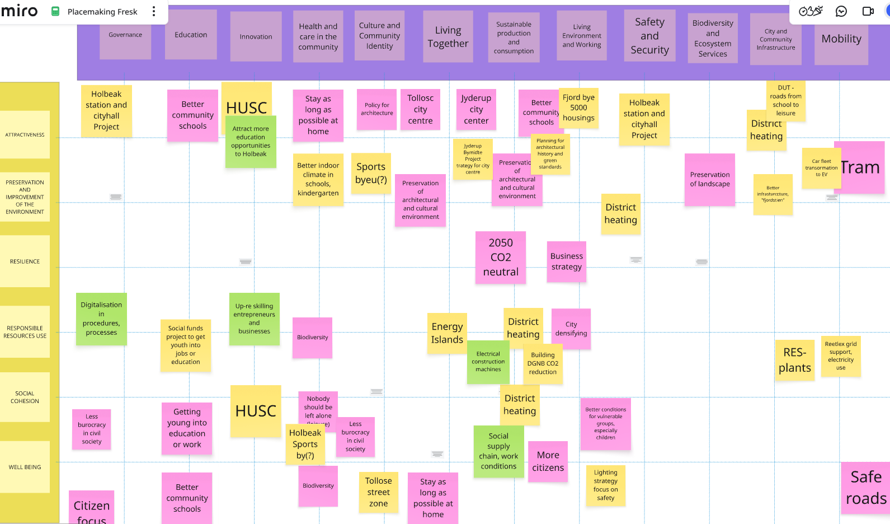

# Description

The below lists all the reports generated from the PlaceMaking Maptivity workshop in Holbæk.

They are based on stickynotes and other inputs from participants, analysed and expanded using AI, are based on data extracted and sourced 
from the web, and include mapping to ISO37101 sustainability goals.

1. [Holbæk -  Where Heritage Meets Sustainability](docs/0_report.md)
2. [Holbæk -  Where History Meets Innovation](docs/1_report.md)
3. [Holbæk Sportsby -  Hub of Health and Activity](docs/2_report.md)
4. [Holbæk's Path to Carbon Neutrality 2050](docs/3_report.md)
5. [Holbæk -  Cultivating Biodiversity Together](docs/4_report.md)
6. [Holbæk -  Innovating Local Education Opportunities](docs/5_report.md)
7. [Empowering Youth -  Tølløse Streetzone Revamp](docs/6_report.md)
8. [Holbæk -  Gateway to Cycling Adventures](docs/7_report.md)
9. [Transforming Holbæk -  The Fjordbyen Vision](docs/8_report.md)
10. [HUSC -  Holbæk's Education Revolution](docs/9_report.md)
11. [Holbæk Sportsby -  Community Hub of Sports](docs/10_report.md)
12. [Holbæk -  Pioneering Denmark's Heating Revolution](docs/11_report.md)
13. [Revitalizing Jyderup -  Nature Meets Community](docs/12_report.md)
14. [Holbæk -  Nurturing Community Well-Being Innovatively](docs/13_report.md)
15. [Holbæk -  Hub for Connected Journeys](docs/14_report.md)

# Capture of stickynotes

